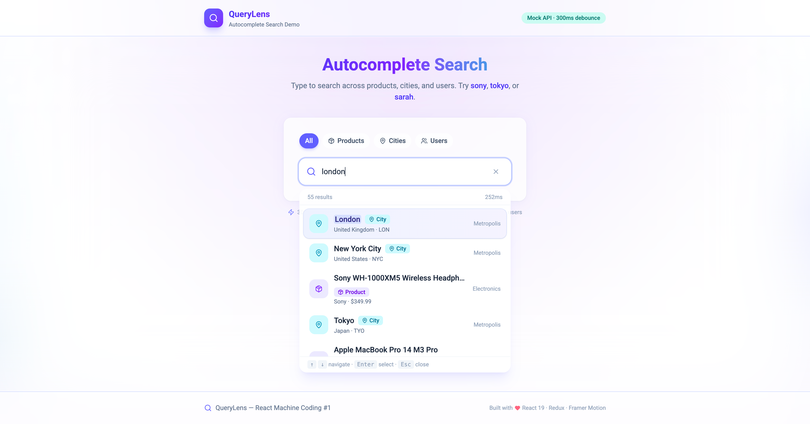

# QueryLens — Autocomplete Search

**React Machine Coding Project #1** — debounced autocomplete with mock API, keyboard navigation, Redux state, and glassmorphism UI.



## Features

| Feature                 | Implementation                                                 |
| ----------------------- | -------------------------------------------------------------- |
| **Debouncing**          | 300ms debounce before API call (`useDebouncedSearch` + Redux)  |
| **API integration**     | Mock service with simulated latency; swap-ready `searchApi.ts` |
| **Keyboard navigation** | ↑ ↓ Enter Esc Tab + ARIA combobox/listbox                      |
| **Loading states**      | Input spinner, dropdown skeleton, debounce-in-flight indicator |
| **Entity filter**       | Products, cities, users (mirrors DB `entity_type` column)      |
| **Animations**          | Framer Motion — dropdown, list stagger, selection panel        |
| **Design**              | Soft Glass Aurora palette (indigo → violet → cyan)             |

## Tech Stack

| Layer   | Technology                  |
| ------- | --------------------------- |
| Build   | Vite 7                      |
| UI      | React 19, TypeScript        |
| Styling | Tailwind CSS 4              |
| State   | Redux Toolkit + React-Redux |
| Motion  | Framer Motion               |
| Icons   | lucide-react                |

## Getting Started

**Prerequisites:** Node.js **24.11.0**

```bash
cd Projects/01-autocomplete-search
npm install
npm run dev
```

Open [http://localhost:5173](http://localhost:5173).

### Try these queries

| Query   | Expected results           |
| ------- | -------------------------- |
| `sony`  | Sony WH-1000XM5 headphones |
| `tokyo` | Tokyo city                 |
| `sarah` | Sarah Chen user            |
| `react` | Users tagged with react    |
| `nike`  | Nike running shoes         |

## Scripts

| Command                 | Description                             |
| ----------------------- | --------------------------------------- |
| `npm run dev`           | Start dev server                        |
| `npm run build`         | Type-check + production build           |
| `npm run preview`       | Preview production build                |
| `npm run lint`          | Run ESLint                              |
| `npm run generate:data` | Regenerate `src/data/search-index.json` |

## Project Structure

```
01-autocomplete-search/
├── src/
│   ├── api/searchApi.ts          # Mock ↔ real API swap point
│   ├── data/
│   │   ├── search-index.json     # 55 mock records (JSON — DB export format)
│   │   └── mockSearchIndex.ts    # Typed loader for JSON data
│   ├── lib/
│   │   ├── store/slices/         # Redux search slice
│   │   └── types/search.ts       # Shared types / API contract
│   ├── hooks/                    # Debounce + click-outside
│   └── components/
│       ├── search/               # Autocomplete UI
│       ├── layout/               # Header, Footer
│       └── ui/                   # Button, etc.
├── ARCHITECTURE.md
├── INTERVIEW-QUESTIONS.md
└── README.md
```

## Switching to a Real API

1. Copy `.env.example` → `.env`
2. Set `VITE_USE_MOCK_API=false`
3. Set `VITE_API_BASE_URL` to your backend
4. Implement `GET /api/search?q=&limit=&offset=&entityType=`
5. Response must match `SearchResponse` in `src/lib/types/search.ts`

See [ARCHITECTURE.md](./ARCHITECTURE.md) for the full API contract and database schema mapping.

## Documentation

| File                                               | Purpose                                    |
| -------------------------------------------------- | ------------------------------------------ |
| [ARCHITECTURE.md](./ARCHITECTURE.md)               | System design, data flow, folder structure |
| [INTERVIEW-QUESTIONS.md](./INTERVIEW-QUESTIONS.md) | Interview Q&A for this project             |

## Related

Part of the **Top 10 React Machine Coding** series in `Interview-Preparation/Projects/`.
