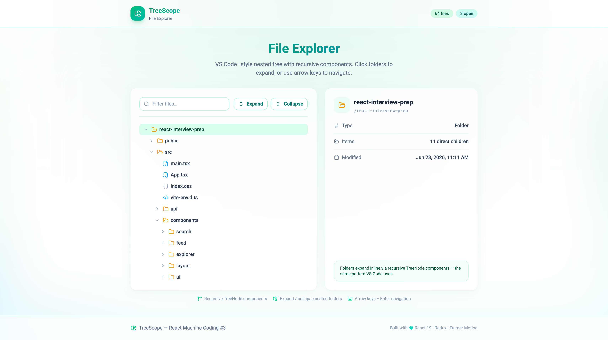

# TreeScope — File Explorer

**React Machine Coding Project #3** — VS Code–style nested file tree with recursive components, expand/collapse, keyboard navigation, and a detail panel.



## Features

| Feature                | Implementation                                              |
| ---------------------- | ----------------------------------------------------------- |
| **Nested folders**     | Deep tree from JSON mock data (86 nodes, 22 folders)        |
| **Expand / collapse**  | Per-folder toggle + Expand All / Collapse All toolbar       |
| **Recursive components** | `TreeNode` renders itself for each child when expanded   |
| **Selection**          | Click row → detail panel with path, size, modified date     |
| **Filter**             | Client-side tree filter preserves matching branches         |
| **Keyboard nav**       | ↑↓ navigate, → expand, ← collapse, Enter/Space toggle       |
| **Loading / error**    | Skeleton loader + retry on failed fetch                     |
| **Mock API**           | JSON tree with simulated 400–800ms latency                  |
| **Design**             | Forest Mint palette (emerald → teal → sky)                    |

## Tech Stack

| Layer   | Technology                  |
| ------- | --------------------------- |
| Build   | Vite 7                      |
| UI      | React 19, TypeScript        |
| Styling | Tailwind CSS 4              |
| State   | Redux Toolkit + React-Redux |
| Motion  | Framer Motion               |
| Icons   | lucide-react                |

## Getting Started

**Prerequisites:** Node.js **24.11.0**

```bash
cd Projects/03-file-explorer
npm install
npm run dev
```

Open [http://localhost:5173](http://localhost:5173) and explore the nested project tree.

## Live Demo

https://file-explorer-eight-nu.vercel.app/

## Scripts

| Command                 | Description                           |
| ----------------------- | ------------------------------------- |
| `npm run dev`           | Start dev server                      |
| `npm run build`         | Type-check + production build         |
| `npm run preview`       | Preview production build              |
| `npm run lint`          | Run ESLint                            |
| `npm run generate:data` | Regenerate `src/data/file-tree.json`  |

## Project Structure

```
03-file-explorer/
├── src/
│   ├── api/explorerApi.ts              # Mock ↔ real API swap point
│   ├── data/
│   │   ├── file-tree.json              # 86-node nested tree (JSON)
│   │   └── mockFileTree.ts             # Typed JSON loader
│   ├── lib/utils/treeHelpers.ts        # find, filter, flatten utilities
│   ├── lib/store/slices/explorerSlice.ts
│   └── components/explorer/
│       ├── FileTree.tsx                # Root tree + keyboard nav
│       ├── TreeNode.tsx                # ★ Recursive component
│       ├── TreeRow.tsx                 # Single row presentation
│       ├── FileIcon.tsx                # Extension-aware icons
│       └── FileDetailPanel.tsx         # Selected item details
├── ARCHITECTURE.md
├── INTERVIEW-QUESTIONS.md
└── README.md
```

## Component Architecture (Interview Focus)

```
ExplorerApp
├── ExplorerToolbar        (filter, expand/collapse all)
├── FileTree               (role="tree", keyboard handler)
│   └── TreeNode           ← RECURSIVE
│       ├── TreeRow        (presentation only)
│       └── TreeNode × N   (children when expanded)
└── FileDetailPanel        (selected node metadata)
```

**Key interview pattern:** `TreeNode` is self-similar — it renders one `TreeRow`, then maps `node.children` back to `<TreeNode />`. State (expanded/selected) lives in Redux; recursion stays pure.

## Mock Data

- **86 nodes** (64 files, 22 folders) in `src/data/file-tree.json`
- Realistic React monorepo layout: `src/components/`, `hooks/`, `lib/store/slices/`, etc.
- DB-shaped fields: `id`, `path`, `type`, `extension`, `sizeBytes`, `modifiedAt`

## Switching to a Real API

1. Copy `.env.example` → `.env`
2. Set `VITE_USE_MOCK_API=false`
3. Implement `GET /api/explorer/tree`
4. Response must match `FileTreeResponse` in `src/lib/types/explorer.ts`

## Demo Error State

Set `VITE_SIMULATE_EXPLORER_ERROR=true` in `.env` to simulate a network error on load.

## Documentation

| File                                               | Purpose                                |
| -------------------------------------------------- | -------------------------------------- |
| [ARCHITECTURE.md](./ARCHITECTURE.md)               | System design, recursion, data flow    |
| [INTERVIEW-QUESTIONS.md](./INTERVIEW-QUESTIONS.md) | Interview Q&A                          |
