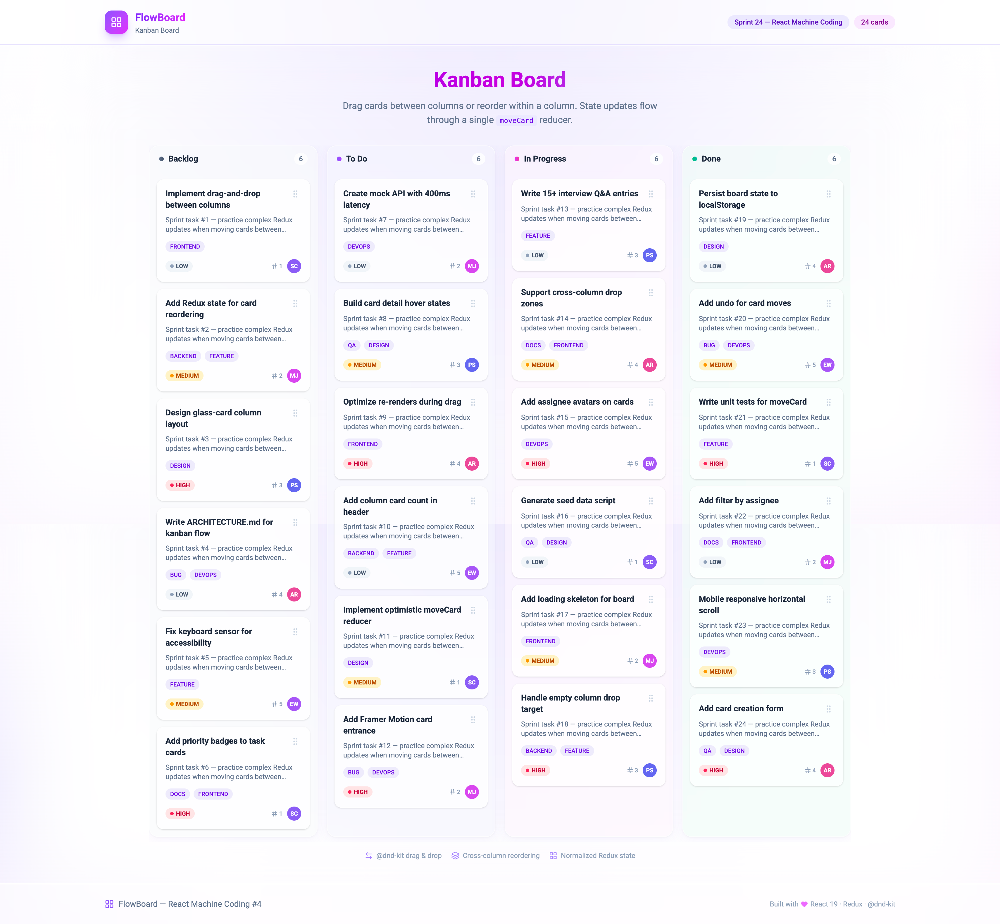

# FlowBoard — Kanban Board

**React Machine Coding Project #4** — Jira/Trello-style kanban with **@dnd-kit** drag-and-drop, normalized Redux state, and cross-column reordering.



## Features

| Feature              | Implementation                                              |
| -------------------- | ----------------------------------------------------------- |
| **Drag & Drop**      | [@dnd-kit/core](https://dndkit.com/) + sortable             |
| **Reordering**       | Within-column + cross-column via `moveCard` reducer         |
| **State management** | Normalized `columns[]` + `cardsById` in Redux Toolkit       |
| **Complex updates**  | Single `applyMoveCard` handles same/different column moves  |
| **Accessibility**    | Keyboard sensor + drag handle                               |
| **Mock API**         | 24 cards across 4 columns with simulated latency            |
| **Design**           | Royal Plum palette (violet → fuchsia → indigo)              |

## Tech Stack

| Layer     | Technology                  |
| --------- | --------------------------- |
| Build     | Vite 7                      |
| UI        | React 19, TypeScript        |
| Styling   | Tailwind CSS 4              |
| State     | Redux Toolkit + React-Redux |
| Drag/Drop | @dnd-kit/core + sortable    |
| Motion    | Framer Motion               |
| Icons     | lucide-react                |

## Getting Started

**Prerequisites:** Node.js **24.11.0**

```bash
cd Projects/04-kanban-board
npm install
npm run dev
```

Open [http://localhost:5173](http://localhost:5173) and drag cards between columns.

## Scripts

| Command                 | Description                            |
| ----------------------- | -------------------------------------- |
| `npm run dev`           | Start dev server                       |
| `npm run build`         | Type-check + production build          |
| `npm run preview`       | Preview production build               |
| `npm run lint`          | Run ESLint                             |
| `npm run generate:data` | Regenerate `src/data/kanban-board.json` |

## Why @dnd-kit?

| Library              | Status        | Notes                          |
| -------------------- | ------------- | ------------------------------ |
| **@dnd-kit**         | ✅ Active     | Modern, a11y, React 19 friendly |
| react-beautiful-dnd  | ❌ Deprecated | Atlassian unmaintained         |
| @hello-pangea/dnd    | ✅ Maintained | Fork of rbd, also valid choice |

We use **@dnd-kit** — the most popular actively maintained option for React DnD in 2024–2026.

## Project Structure

```
04-kanban-board/
├── src/
│   ├── api/kanbanApi.ts
│   ├── hooks/useKanbanDragDrop.ts      # DnD event handlers
│   ├── lib/store/slices/kanbanSlice.ts # moveCard reducer
│   └── components/kanban/
│       ├── KanbanBoard.tsx             # DndContext wrapper
│       ├── KanbanColumn.tsx            # Droppable + SortableContext
│       └── KanbanCard.tsx              # useSortable card
├── ARCHITECTURE.md
├── INTERVIEW-QUESTIONS.md
└── README.md
```

## Mock Data

- **4 columns:** Backlog, To Do, In Progress, Done
- **24 cards** with priority, assignee, labels, story points
- Normalized JSON: `columns[].cardIds` + `cardsById`

## Switching to a Real API

1. Copy `.env.example` → `.env`
2. Set `VITE_USE_MOCK_API=false`
3. Implement `GET /api/kanban/board`
4. Response must match `KanbanBoardResponse` in `src/lib/types/kanban.ts`
5. Persist moves via `PATCH /api/kanban/cards/:id/move`

## Documentation

| File                                               | Purpose                                |
| -------------------------------------------------- | -------------------------------------- |
| [ARCHITECTURE.md](./ARCHITECTURE.md)               | State design, DnD flow, moveCard logic |
| [INTERVIEW-QUESTIONS.md](./INTERVIEW-QUESTIONS.md) | Interview Q&A                          |
