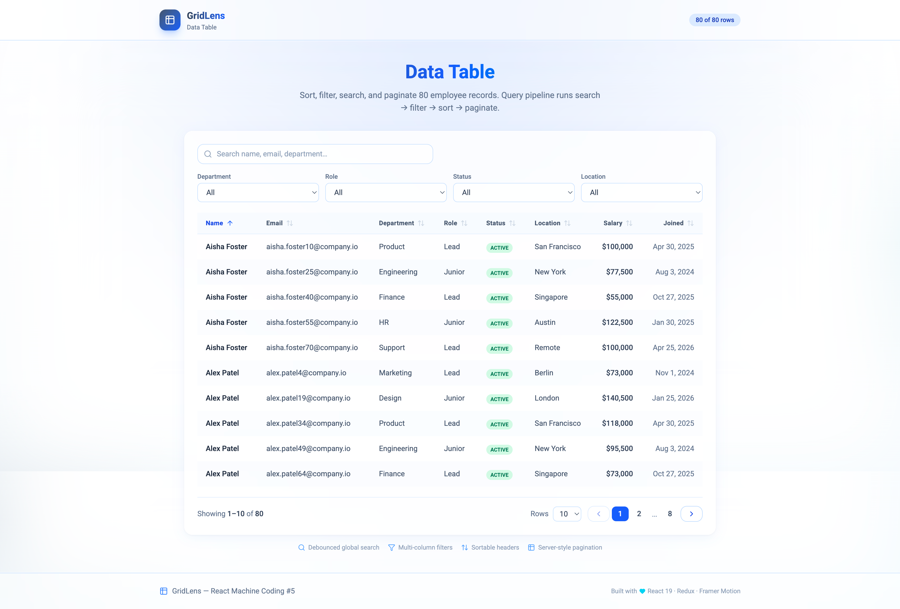

# GridLens — Data Table

**React Machine Coding Project #5** — sortable, filterable, searchable employee table with server-style pagination and a pure query pipeline.



## Features

| Feature         | Implementation                                           |
| --------------- | -------------------------------------------------------- |
| **Sorting**     | Click column headers — asc/desc toggle with `aria-sort`  |
| **Filtering**   | Department, role, status, location dropdowns           |
| **Search**      | 300ms debounced global search across key fields          |
| **Pagination**  | Page nav + page size (10 / 25 / 50)                      |
| **Data pipeline** | `search → filter → sort → paginate` in `tableQuery.ts` |
| **Mock API**    | 80 employee records, simulated 350–700ms latency         |
| **Extras**      | Empty state, loading overlay, clear-all, row count       |
| **Design**      | Ocean Steel palette (slate → blue → cyan)                |

## Tech Stack

| Layer   | Technology                  |
| ------- | --------------------------- |
| Build   | Vite 7                      |
| UI      | React 19, TypeScript        |
| Styling | Tailwind CSS 4              |
| State   | Redux Toolkit + React-Redux |
| Motion  | Framer Motion               |
| Icons   | lucide-react                |

## Getting Started

**Prerequisites:** Node.js **24.11.0**

```bash
cd Projects/05-data-table
npm install
npm run dev
```

Open [http://localhost:5173](http://localhost:5173) and try sorting, filtering, and searching.

## Scripts

| Command                 | Description                          |
| ----------------------- | ------------------------------------ |
| `npm run dev`           | Start dev server                     |
| `npm run build`         | Type-check + production build        |
| `npm run preview`       | Preview production build             |
| `npm run lint`          | Run ESLint                           |
| `npm run generate:data` | Regenerate `src/data/employees.json` |

## Query Pipeline (Interview Focus)

```typescript
// tableQuery.ts — pure functions, easy to unit test
applySearch(rows, search)
  → applyFilters(rows, filters)
  → applySort(rows, sortBy, sortOrder)
  → paginateRows(rows, page, pageSize)
```

Redux holds `query` params; `loadTableData` thunk sends them to the mock API which runs the same pipeline.

## Project Structure

```
05-data-table/
├── src/
│   ├── api/tableApi.ts
│   ├── lib/utils/tableQuery.ts       ★ data manipulation
│   ├── lib/store/slices/tableSlice.ts
│   └── components/table/
│       ├── DataTable.tsx
│       ├── TableHeaderRow.tsx        (sortable)
│       ├── TableFilters.tsx
│       ├── TablePagination.tsx
│       └── TableToolbar.tsx          (debounced search)
├── ARCHITECTURE.md
├── INTERVIEW-QUESTIONS.md
└── README.md
```

## Mock Data

- **80 employees** in `src/data/employees.json`
- Fields: name, email, department, role, status, location, salary, joinDate
- 8 departments, 6 roles, 3 statuses, 8 locations

## Switching to a Real API

1. Copy `.env.example` → `.env`
2. Set `VITE_USE_MOCK_API=false`
3. Implement `GET /api/employees?page=&pageSize=&sortBy=&sortOrder=&search=&department=...`
4. Response must match `TableQueryResponse` in `src/lib/types/table.ts`

## Documentation

| File                                               | Purpose                                |
| -------------------------------------------------- | -------------------------------------- |
| [ARCHITECTURE.md](./ARCHITECTURE.md)               | Query pipeline, state design, API      |
| [INTERVIEW-QUESTIONS.md](./INTERVIEW-QUESTIONS.md) | Interview Q&A                          |
