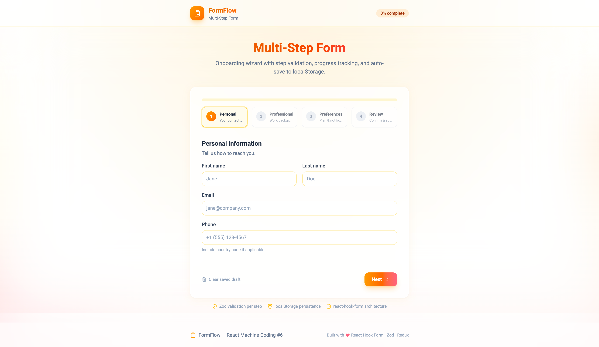

# FormFlow — Multi-Step Form

**React Machine Coding Project #6** — onboarding wizard with **react-hook-form**, **Zod** validation, progress tracking, and **localStorage** persistence.



## Features

| Feature               | Implementation                                      |
| --------------------- | --------------------------------------------------- |
| **Validation**        | Zod schemas per step + `zodResolver`                |
| **Progress tracking** | Step indicator, progress bar, completed step badges |
| **State persistence** | Auto-save form + step to `localStorage` on change   |
| **Form architecture** | `FormProvider` + isolated step components           |
| **Step validation**   | `trigger()` only current step fields on Next        |
| **Review step**       | Read-only summary before submit                     |
| **Mock API**          | Simulated POST with 800–1400ms latency              |
| **Design**            | Sunrise Gold palette (amber → orange → rose)         |

## Tech Stack

| Layer      | Technology                    |
| ---------- | ----------------------------- |
| Build      | Vite 7                        |
| UI         | React 19, TypeScript          |
| Forms      | react-hook-form + @hookform/resolvers |
| Validation | Zod                           |
| State      | Redux Toolkit (wizard meta)   |
| Motion     | Framer Motion                 |

## Getting Started

**Prerequisites:** Node.js **24.11.0**

```bash
cd Projects/06-multi-step-form
npm install
npm run dev
```

Open [http://localhost:5173](http://localhost:5173) — fill step 1, refresh the page, and your draft restores.

## Scripts

| Command           | Description                   |
| ----------------- | ----------------------------- |
| `npm run dev`     | Start dev server              |
| `npm run build`   | Type-check + production build |
| `npm run preview` | Preview production build      |
| `npm run lint`    | Run ESLint                    |

## Wizard Steps

| Step | Title        | Fields                                      |
| ---- | ------------ | ------------------------------------------- |
| 1    | Personal     | firstName, lastName, email, phone           |
| 2    | Professional | company, jobTitle, experienceYears, linkedIn |
| 3    | Preferences  | plan, timezone, newsletter, smsAlerts       |
| 4    | Review       | Summary + Submit                            |

## Form Architecture (Interview Focus)

```
WizardApp
├── FormProvider (react-hook-form — all field values)
├── WizardProgress (Redux: currentStep, completedSteps)
├── StepPersonal | StepProfessional | StepPreferences | StepReview
├── WizardNavigation (trigger step fields → next/submit)
└── useFormPersistence (localStorage sync)
```

**Split:** RHF owns **form values**; Redux owns **wizard navigation** (step index, completed, submit status).

## Persistence

Draft saved to `localStorage` key `formflow-wizard-draft`:

```json
{
  "formValues": { ... },
  "currentStep": 1,
  "completedSteps": [0],
  "savedAt": "2026-06-24T..."
}
```

Cleared on successful submit or "Clear saved draft".

## Documentation

| File                                               | Purpose                          |
| -------------------------------------------------- | -------------------------------- |
| [ARCHITECTURE.md](./ARCHITECTURE.md)               | Form design, validation, persistence |
| [INTERVIEW-QUESTIONS.md](./INTERVIEW-QUESTIONS.md) | Interview Q&A                    |
