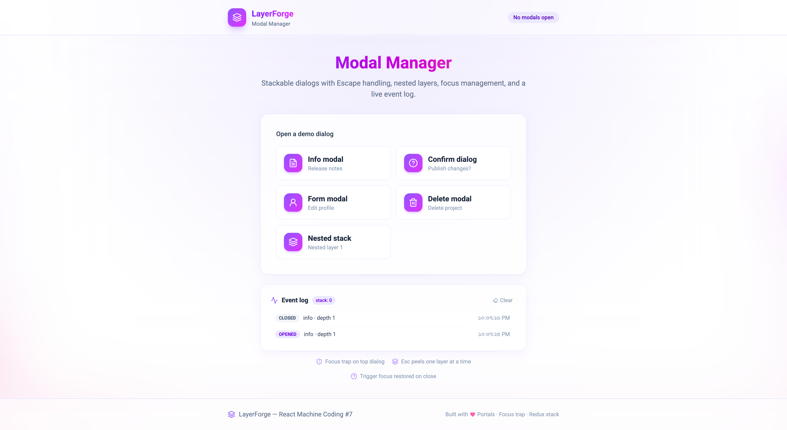

# LayerForge — Modal Manager

**React Machine Coding Project #7** — stackable dialog system with **nested modals**, **Escape key handling**, **focus trap**, and **accessibility** primitives.



## Features

| Feature | Implementation |
| ------- | -------------- |
| **Open / close** | Redux modal stack + `useModal()` hook |
| **Nested modals** | Stack depth drives z-index; only top layer is interactive |
| **Escape key** | Capture-phase listener closes top modal only |
| **Backdrop click** | Top modal only; logged as `backdrop` event |
| **Focus trap** | Tab cycles within top dialog via `useFocusTrap` |
| **Focus restore** | Returns focus to trigger button on close |
| **Accessibility** | `role="dialog"`, `aria-modal`, labelled/described regions |
| **Body scroll lock** | `overflow: hidden` while stack is non-empty |
| **Event log** | Live panel tracks open / close / escape / nested events |
| **Design** | Twilight Orchid palette (violet → fuchsia → pink) |

## Tech Stack

| Layer | Technology |
| ----- | ---------- |
| Build | Vite 7 |
| UI | React 19, TypeScript |
| State | Redux Toolkit (modal stack + event log) |
| Motion | Framer Motion |
| Portals | `react-dom/createPortal` |

## Getting Started

**Prerequisites:** Node.js **24.11.0**

```bash
cd Projects/07-modal-manager
npm install
npm run dev
```

Open [http://localhost:5173](http://localhost:5173) — try **Nested stack**, press `Esc` three times, and watch the event log.

## Scripts

| Command | Description |
| ------- | ----------- |
| `npm run dev` | Start dev server |
| `npm run build` | Type-check + production build |
| `npm run preview` | Preview production build |
| `npm run lint` | Run ESLint |

## Demo Modals

| Trigger | Purpose |
| ------- | ------- |
| Info modal | Simple dismiss dialog |
| Confirm dialog | Cancel / confirm actions |
| Form modal | Focus trap with text inputs |
| Delete modal | Destructive action + async mock API |
| Nested stack | Open up to 3 stacked layers |

## Architecture (Interview Focus)

```
ModalApp (triggers)
├── useModal() → dispatch openModal
├── ModalEventLog ← Redux events[]
└── ModalHost
    ├── useGlobalEscapeKey (capture phase)
    ├── useBodyScrollLock
    └── ModalLayer[] (portal per stack entry)
        ├── useFocusTrap (top only)
        └── ModalContent → Info | Confirm | Form | Delete | Nested
```

**Split:** Redux owns the **stack**; DOM refs (trigger elements) live outside Redux in `modalFocusRegistry`.

## Key Files

| Path | Role |
| ---- | ---- |
| `src/lib/store/slices/modalSlice.ts` | Stack push/pop, event log |
| `src/hooks/useModal.ts` | Public open/close/closeAll API |
| `src/hooks/useFocusTrap.ts` | Tab cycle within dialog |
| `src/hooks/useEscapeKey.ts` | Global Escape → close top |
| `src/components/modal/ModalLayer.tsx` | Portal + a11y shell |
| `src/lib/utils/modalFocusRegistry.ts` | Trigger element map |

## Docs

- [ARCHITECTURE.md](./ARCHITECTURE.md) — system design, event flow, a11y checklist
- [INTERVIEW-QUESTIONS.md](./INTERVIEW-QUESTIONS.md) — interview Q&A
