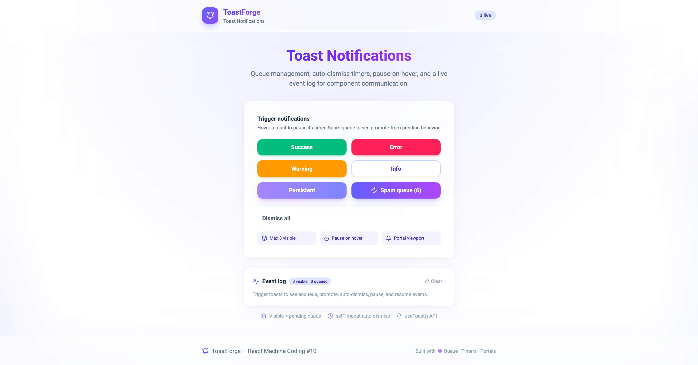

# ToastForge — Toast Notification System

**React Machine Coding Project #10** — toast queue with **auto-dismiss timers**, **pause-on-hover**, and a **`useToast()` hook** for component communication.



## Features

| Feature | Implementation |
| ------- | -------------- |
| **Queue management** | `visible[]` + `pending[]`, max 3 on screen |
| **Auto-dismiss** | Per-toast `setTimeout` in `useAutoDismiss` |
| **Multiple notifications** | Stacked viewport via portal |
| **Pause on hover** | Timer + CSS progress bar pause together |
| **Manual dismiss** | Close button + Dismiss all |
| **Persistent toasts** | `duration: 0` skips timer |
| **Component API** | `useToast()` → `success`, `error`, `warning`, `info` |
| **Event log** | enqueue, promote, auto-dismiss, pause, resume |
| **Design** | Signal Indigo palette (indigo → violet → purple) |

## Tech Stack

| Layer | Technology |
| ----- | ---------- |
| Build | Vite 7 |
| UI | React 19, TypeScript |
| State | Redux Toolkit |
| Motion | Framer Motion + CSS keyframes |
| Portals | `createPortal` → top-right viewport |

## Getting Started

**Prerequisites:** Node.js **24.11.0**

```bash
cd Projects/10-toast-notifications
npm install
npm run dev
```

Open [http://localhost:5173](http://localhost:5173) — click **Spam queue (6)**, hover a toast, watch the event log.

## Scripts

| Command | Description |
| ------- | ----------- |
| `npm run dev` | Start dev server |
| `npm run build` | Type-check + production build |
| `npm run preview` | Preview production build |
| `npm run lint` | Run ESLint |

## Architecture (Interview Focus)

```
Any component
  → useToast().success('Saved!')
  → dispatch enqueueToast
  → visible (≤3) or pending queue

ToastHost / ToastViewport (portal)
  └── ToastItem × N
        ├── useAutoDismiss (setTimeout + pause/resume)
        └── dispatch dismissToast → promoteNext from pending
```

## Queue Rules

| Rule | Value |
| ---- | ----- |
| Max visible | 3 |
| On dismiss | Promote oldest pending toast |
| Persistent | `duration: 0` |

## Docs

- [ARCHITECTURE.md](./ARCHITECTURE.md) — queue flow, timers, communication patterns
- [INTERVIEW-QUESTIONS.md](./INTERVIEW-QUESTIONS.md) — interview Q&A
